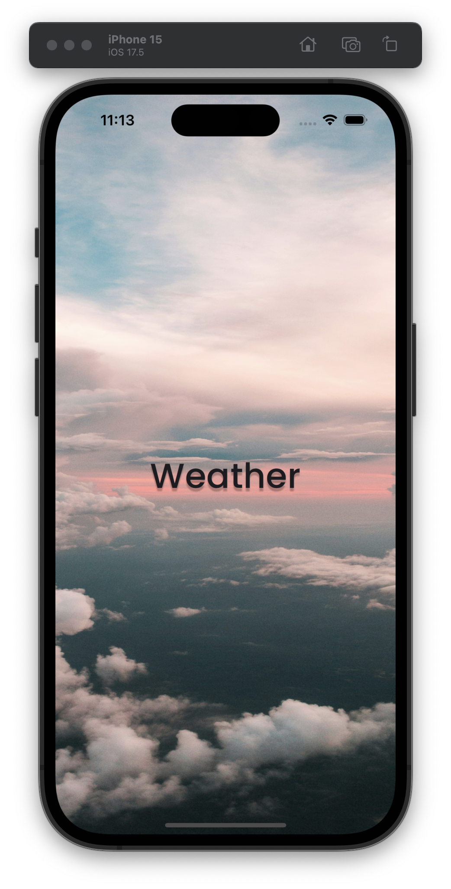
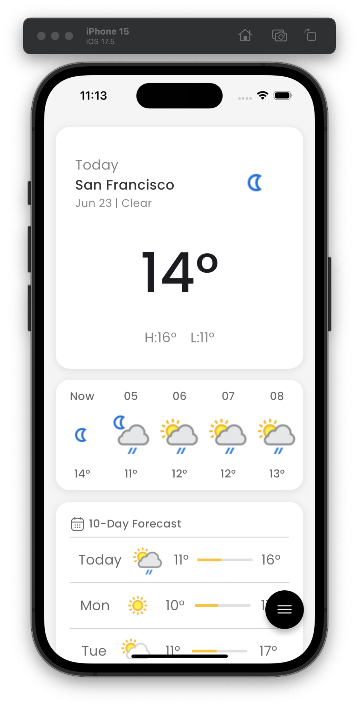
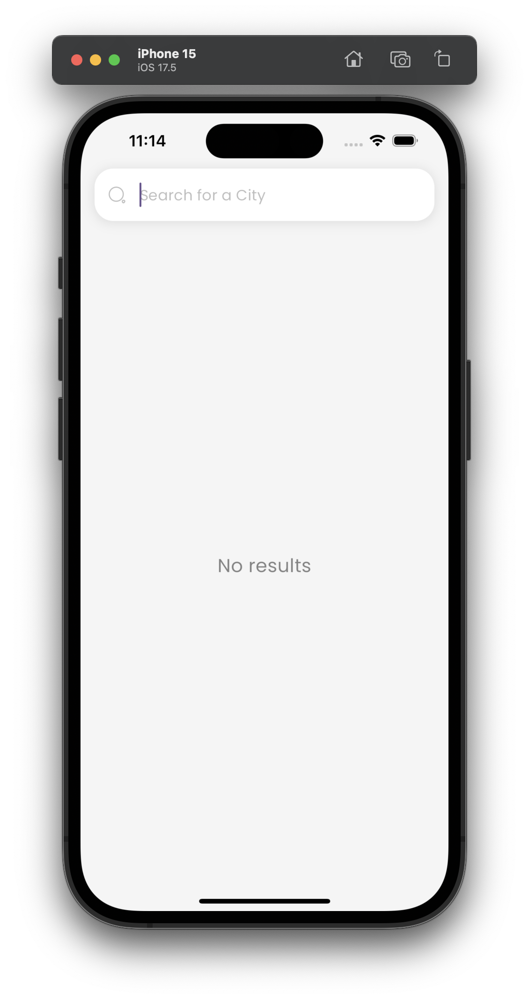
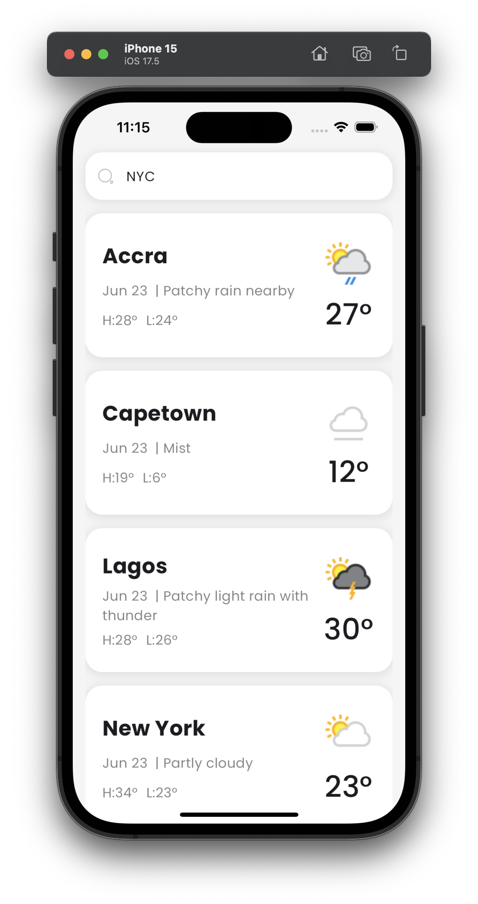
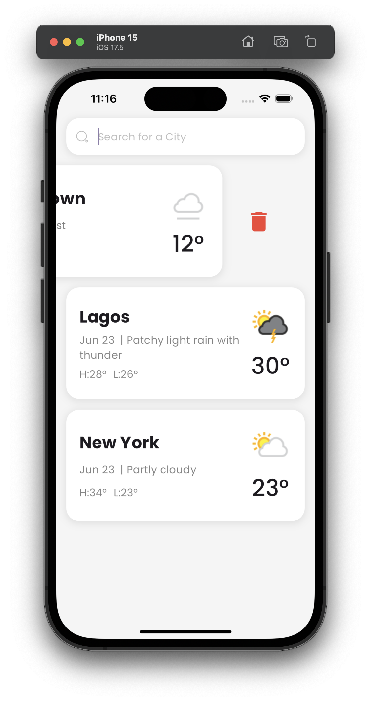
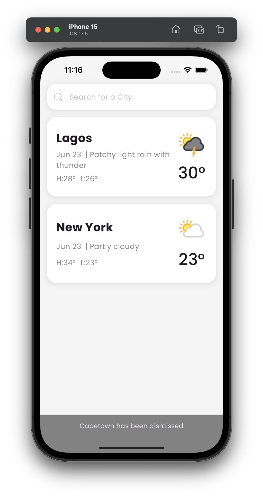
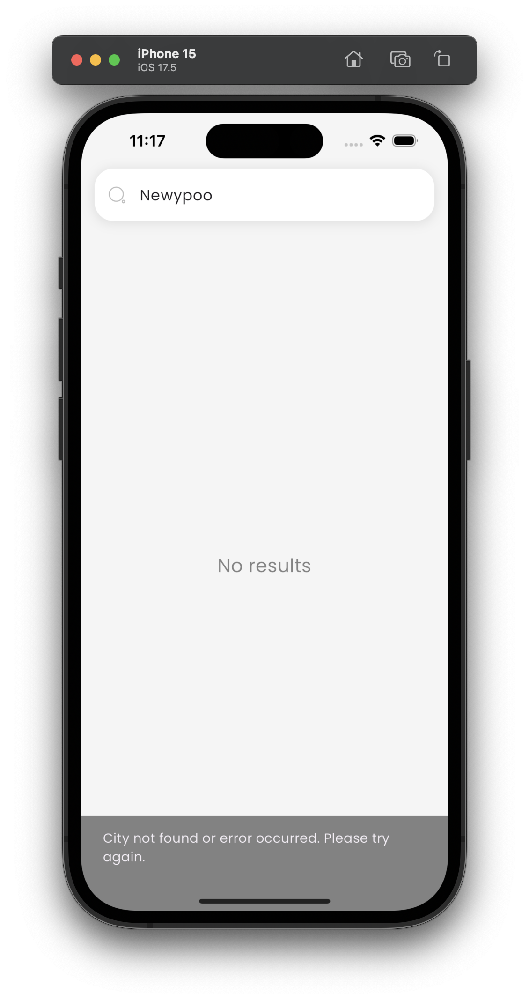

# Weather App

A Flutter weather app that provides real-time weather updates and forecasts using the Geolocator API for location services and WeatherAPI for weather data.

## Features

- Real-time weather updates
- 10-day weather forecast
- Current temperature
- Location-based weather data using GPS
- Search for weather information of any city

## Screenshots

    Onboarding Screen

     Home Screen

     Search Screen

     Search City Added

     City Ondismiss

     City Dismissed

     City Notfound

